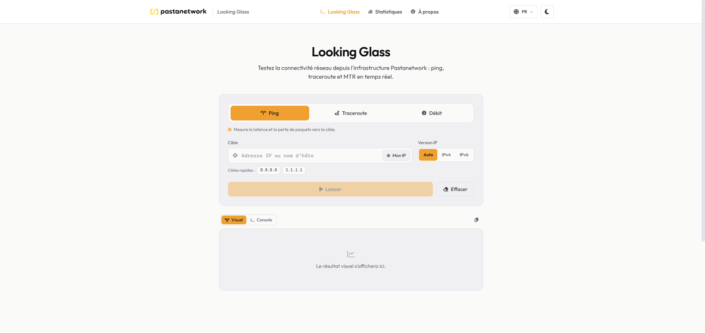
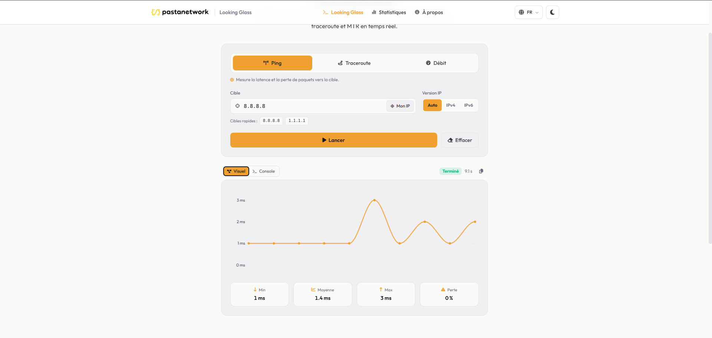
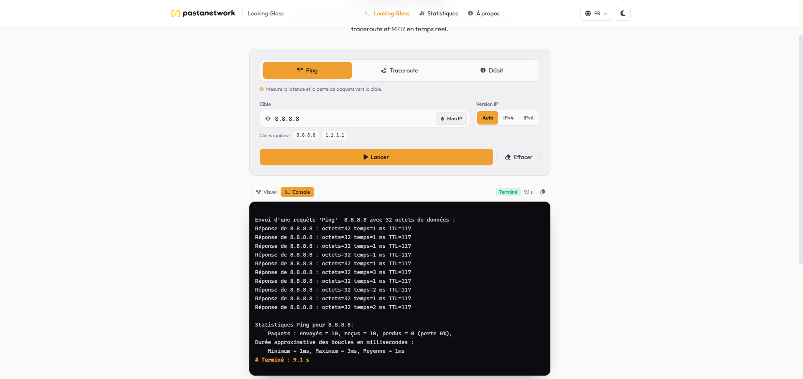
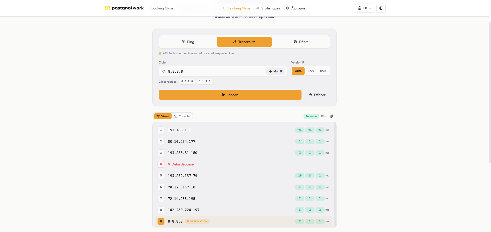
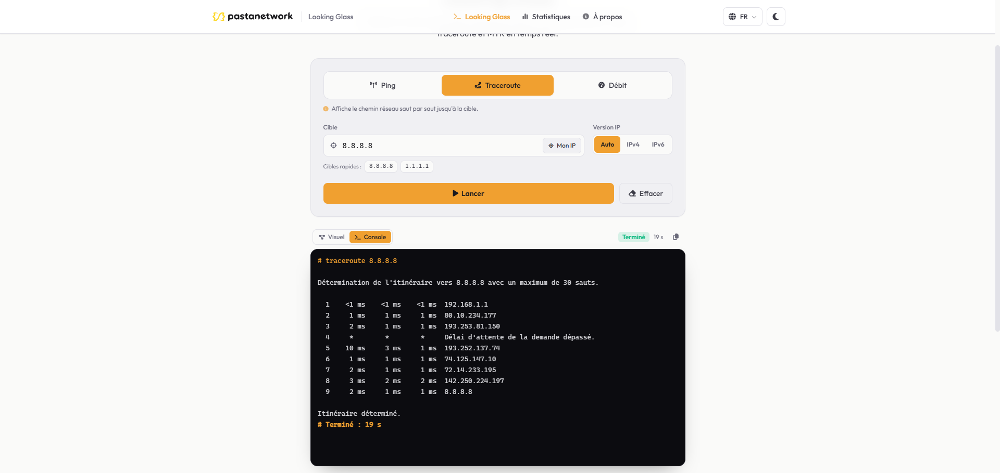
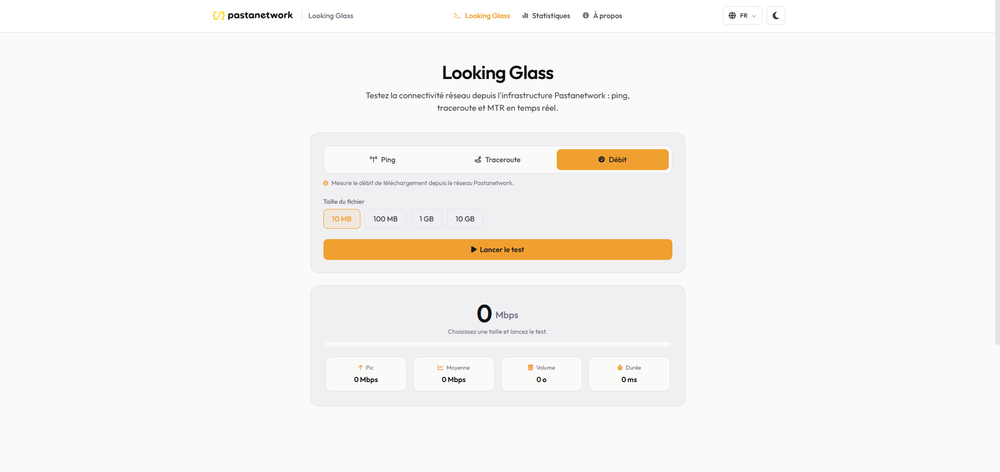
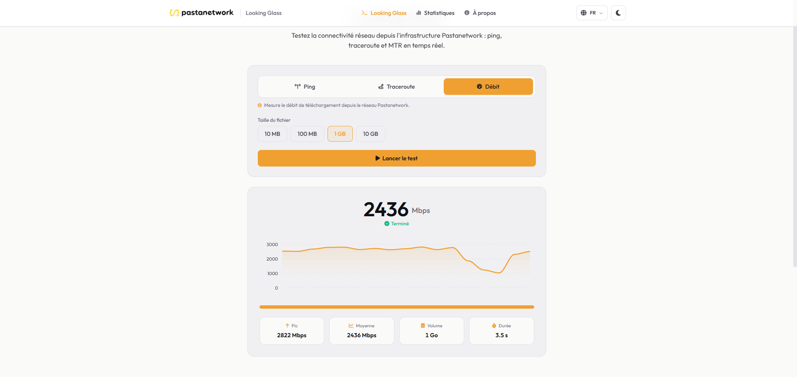
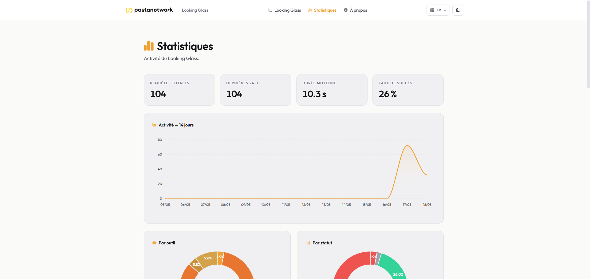
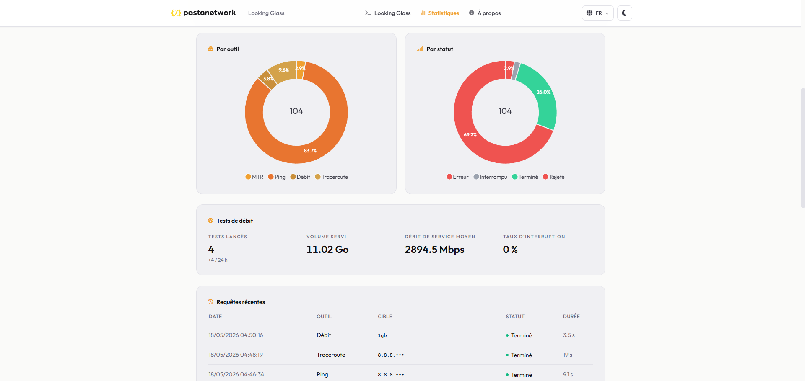
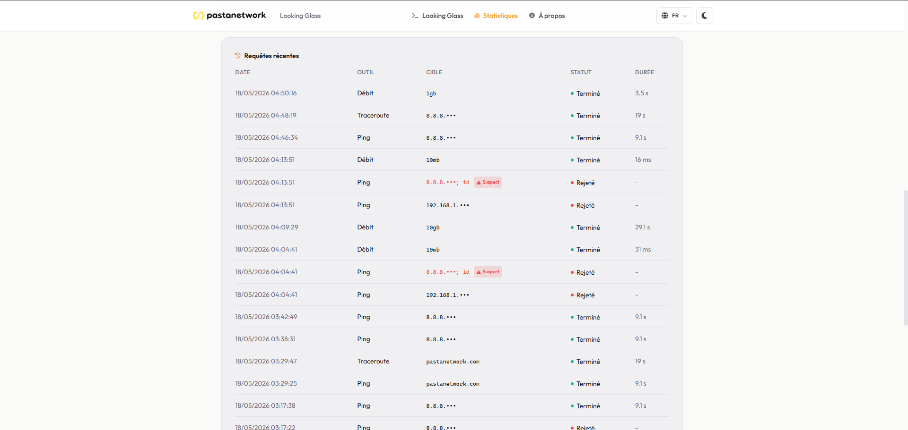

# Pastanetwork Looking Glass

Un Looking Glass est une page de diagnostic réseau publique. Ce projet permet à
n'importe quel visiteur de lancer un ping, un traceroute, un MTR ou une interrogation
DNS depuis le réseau de Pastanetwork vers la cible de son choix, et d'en suivre le
résultat en direct.

Tout tient dans une seule image Docker (l'application et son Redis interne), à placer
derrière votre reverse proxy. Pas de compte, pas de service externe à gérer.

<p align="center">
  
</p>

## Fonctionnalités

- ping, traceroute et MTR, en IPv4 comme en IPv6
- interrogation DNS : enregistrements (A, AAAA, MX, NS, TXT…) ou résolution pas à pas (dig +trace)
- résultat diffusé ligne par ligne (Server-Sent Events), comme dans un terminal
- journal des requêtes en SQLite et page de statistiques
- interface française et anglaise, thème clair et sombre
- fichiers de test de débit en option, désactivés par défaut

L'architecture sépare l'outil du nœud qui l'exécute. Un seul nœud aujourd'hui, mais
ajouter des points de présence distants ne demandera pas de tout réécrire.

## Aperçu

Chaque résultat se consulte de deux façons : une **vue visuelle** synthétique ou la
**console brute**, telle que la commande la produit.

### Ping

| Vue visuelle | Console |
|---|---|
|  |  |

### Traceroute

| Vue visuelle | Console |
|---|---|
|  |  |

### Test de débit

| Lancement | Résultat |
|---|---|
|  |  |

### Statistiques

| Chiffres clés et activité | Répartitions et débit | Requêtes récentes |
|---|---|---|
|  |  |  |

## Installation avec Docker

### Prérequis
- Docker
- Une paire de clés [Cloudflare Turnstile][turnstile], gratuites. La vérification
  anti-robot est **obligatoire en production** : sans ces clés, l'application refuse
  de démarrer.

### Mise en route rapide

```bash
cp .env.example .env
# Renseignez au minimum TURNSTILE_SITE_KEY et TURNSTILE_SECRET_KEY dans .env.

python lg.py build      # construit l'image Docker (looking-glass:local)
python lg.py run        # lance le conteneur sur le port 8080
```

`python lg.py run` est pratique pour un essai, mais lance le conteneur avec `--rm` et
**sans volume de données** : le journal des requêtes et le sel de hachage sont perdus à
l'arrêt. Pour une mise en production, préférez un `docker run` explicite (ci-dessous).

### Lancement en production

```bash
docker build -f deploy/Dockerfile -t looking-glass:local .

docker run -d --name looking-glass \
  -p 8080:8080 \
  --cap-drop ALL --cap-add NET_RAW \
  --env-file .env \
  -e DEV=False \
  -v "$(pwd)/data:/app/data" \
  -v "$(pwd)/config:/config:ro" \
  looking-glass:local
```

Points importants :

- `--cap-drop ALL --cap-add NET_RAW` : le conteneur tourne sans privilège, avec la seule
  capability nécessaire aux sockets ICMP. Le processus applicatif n'est pas root.
- `-v ./data:/app/data` : **persiste** la base SQLite (`looking_glass.db`) et le sel
  `.ip_hash_salt`. Sans ce volume, le journal et le sel repartent de zéro à chaque
  redémarrage.
- `-v ./config:/config:ro` : monte le `config.json` optionnel (voir plus bas). À omettre
  si vous n'en utilisez pas.
- `-e DEV=False` : l'image ne contient que les assets minifiés ; le mode développement
  n'y a pas de sens. `python lg.py run` force d'ailleurs cette valeur.

Un fichier `deploy/compose.yaml` est également fourni pour un déploiement via Docker
Compose (ou un gestionnaire de stacks comme Dockge), avec volumes nommés et capabilities
déjà configurés.

L'application écoute sur le port 8080. Le conteneur embarque son propre Redis, aucun
service externe n'est requis. Un endpoint `/api/v1/health` est exposé pour le
`HEALTHCHECK` Docker (qui interroge l'application en interne au conteneur). Il est
**bloqué publiquement par nginx** dans l'exemple fourni décommentez la ligne
correspondante si vous avez besoin de monitoring externe.

### Reverse proxy

Mettez votre reverse proxy devant le conteneur. Un exemple de vhost nginx est fourni
dans `deploy/nginx.conf.example`. Le **buffering doit être désactivé** sur la route
`/api/v1/run` (streaming SSE), et le reverse proxy doit transmettre l'en-tête
`X-Real-IP` (voir `TRUSTED_PROXY_HOSTS`).

Pour le speedtest, l'application délègue le téléchargement à nginx via
`X-Accel-Redirect` : Quart valide la requête (Turnstile, token, budget, concurrence)
puis nginx sert un fichier sparse en zero-copy (`sendfile`). Une `post_action` rappelle
ensuite l'application pour ajuster les compteurs et journaliser. Avant d'activer la
fonctionnalité :

1. Exécutez `deploy/scripts/create-speedtest-files.sh` **sur la VM nginx** (ou la même
   machine si nginx est local). Le script crée des fichiers sparse (10mb.bin …
   10gb.bin) qui n'occupent quasiment aucun espace disque.
2. Recopiez le bloc « SPEEDTEST » de `deploy/nginx.conf.example` dans votre vhost.
3. Posez la même valeur de `SPEEDTEST_FINALIZE_SECRET` dans `.env` côté application
   et dans la directive `proxy_set_header X-Speedtest-Auth` côté nginx.

[turnstile]: https://dash.cloudflare.com/?to=/:account/turnstile

## Configuration

La configuration provient de trois couches, appliquées dans cet ordre :

1. les **valeurs par défaut** intégrées au code
2. le fichier **`config.json`** optionnel, qui se superpose aux défauts
3. les **variables d'environnement**, qui priment sur tout le reste

Les clés Turnstile sont les seules valeurs obligatoires. `IP_HASH_SALT` et
`REDIS_PASSWORD` sont générés automatiquement s'ils sont absents.

### Variables d'environnement (`.env`)

Copiez `.env.example` en `.env`. Toutes les variables y sont commentées dans le
fichier. En voici le détail.

#### Général

| Variable | Défaut | Rôle |
|---|---|---|
| `DEV` | `False` | Mode développement (reload, bypass Turnstile possible). Laisser `False` en production. `python lg.py dev` l'active localement, `python lg.py run` force `False`. |
| `LG_CONFIG_FILE` | `/config/config.json` | Chemin du fichier `config.json` structuré. |

#### Serveur HTTP

| Variable | Défaut | Rôle |
|---|---|---|
| `LG_HOST` | `0.0.0.0` | Interface d'écoute de l'application. |
| `LG_PORT` | `8080` | Port d'écoute interne au conteneur. |
| `LG_WORKERS` | `4` | Nombre de workers Hypercorn. |
| `LG_PUBLIC_URL` | *(vide)* | URL publique canonique, utilisée pour le SEO et les balises des templates. Laisser vide en local. |
| `LG_DB_PATH` | `data/looking_glass.db` | Chemin de la base SQLite. À conserver dans le volume `/app/data`. |
| `TRUSTED_PROXY_HOSTS` | `127.0.0.1` | Hôtes (séparés par des virgules) autorisés à réécrire l'IP cliente via l'en-tête `X-Real-IP`. Mettez-y l'IP de votre reverse proxy. |
| `ALLOWED_HOSTS` | *(vide)* | Noms d'hôte acceptés dans l'en-tête `Host` (séparés par des virgules, motif `*.domaine` autorisé). Vide = tout accepter. Les hôtes loopback restent toujours acceptés. |

#### CORS

| Variable | Défaut | Rôle |
|---|---|---|
| `CORS_ALLOW_ORIGIN` | *(vide)* | Origines autorisées en CORS (séparées par des virgules, ex. `https://exemple.com`). Vide = same-origin uniquement : l'API n'est consommée que par le frontend du Looking Glass. |

Les autres réglages CORS (méthodes, en-têtes autorisés et exposés, `max-age`) se font
dans le fichier `config.json`, section `cors`.

#### Cloudflare

| Variable | Défaut | Rôle |
|---|---|---|
| `CLOUDFLARE_ENABLED` | `False` | À mettre à `True` si le site est servi derrière Cloudflare. L'application lit alors l'IP réelle du visiteur dans l'en-tête `CF-Connecting-IP`, au lieu de l'IP d'un proxy Cloudflare. |

L'en-tête `CF-Connecting-IP` n'est honoré que si la requête provient réellement d'une
plage Cloudflare — il est donc infalsifiable. Les plages sont récupérées au démarrage
depuis Cloudflare, avec une liste intégrée en repli si la récupération échoue. Aucun
réglage nginx n'est nécessaire.

#### Redis (interne au conteneur, éphémère)

| Variable | Défaut | Rôle |
|---|---|---|
| `REDIS_HOST` | `127.0.0.1` | Hôte Redis. |
| `REDIS_PORT` | `6379` | Port Redis. |
| `REDIS_PASSWORD` | *(auto)* | Mot de passe Redis. Généré automatiquement par l'entrypoint Docker si vide. |

#### Sécurité

| Variable | Défaut | Rôle |
|---|---|---|
| `IP_HASH_SALT` | *(auto)* | Sel de hachage SHA-256 des IP sources. Auto-généré puis persisté dans `data/.ip_hash_salt` s'il est absent. Renseignez-le pour un sel stable et explicite. |
| `TURNSTILE_SITE_KEY` | *(requis)* | Clé publique Cloudflare Turnstile. |
| `TURNSTILE_SECRET_KEY` | *(requis)* | Clé secrète Cloudflare Turnstile. |
| `TURNSTILE_DEV_BYPASS` | `False` | Court-circuite la vérification Turnstile. Sans effet sauf si `DEV=True`. |

#### Plafonds de concurrence (anti-abus)

| Variable | Défaut | Rôle |
|---|---|---|
| `GLOBAL_COMMAND_CAP` | `8` | Nombre maximum de commandes simultanées, tous clients confondus. |
| `PER_IP_COMMAND_CAP` | `2` | Nombre maximum de commandes simultanées par IP cliente. |

#### Speedtest (test de débit, désactivé par défaut)

Fonctionnalité opt-in. Les valeurs livrées dans `.env.example` sont des garde-fous
sûrs : si vous l'activez, le speedtest ne pourra pas faire déraper une facturation
transit au 95e centile ni votre volume mensuel.

| Variable | Défaut | Rôle |
|---|---|---|
| `SPEEDTEST_ENABLED` | `False` | Active la fonctionnalité de test de débit. |
| `SPEEDTEST_DAILY_BYTE_BUDGET` | `0` (illimité) | Volume total servi par jour, tous clients confondus. Une fois atteint, le speedtest est coupé jusqu'au lendemain — c'est LE garde-fou. `.env.example` propose `805306368000` (750 Gio/jour). |
| `SPEEDTEST_PER_IP_BYTE_BUDGET` | `0` (illimité) | Volume servi par IP et par jour. `.env.example` propose `32212254720` (30 Gio/jour). |
| `SPEEDTEST_CONCURRENCY` | `16` | Connexions speedtest simultanées, tous clients confondus. Un test en ligne de commande ouvre 4 connexions en parallèle : prévoir un multiple de 4. |
| `SPEEDTEST_FINALIZE_SECRET` | *(requis si activé en prod)* | Secret partagé entre nginx (`proxy_set_header X-Speedtest-Auth` du bloc `@speedtest_finalize`) et l'application, vérifié en temps constant. Génération : `openssl rand -hex 32`. En mode `DEV=True`, l'application tolère un secret vide. |
| `SPEEDTEST_XACCEL_PREFIX` | `/__internal__/speedtest` | Préfixe d'URI interne utilisé dans l'en-tête `X-Accel-Redirect`. À aligner avec la location interne dans `nginx.conf`. À ne changer que si le préfixe entre en conflit avec une autre route. |

##### Test de débit depuis un terminal

Le speedtest de l'interface est un test navigateur : il mesure le débit *de la machine
qui affiche la page*. Pour mesurer le débit d'un serveur Linux sans navigateur, l'onglet
« Débit » propose un bouton **Tester depuis un terminal**.

Le navigateur résout Turnstile une fois, puis l'application délivre un token éphémère
(valable 5 minutes, non lié à l'IP, la machine testée peut donc différer de celle qui
a ouvert la page) et affiche **une commande unique** à coller, adaptée au système :

```bash
# Linux / macOS
curl -fsSL "https://lg.exemple.net/api/v1/speedtest/cli/script/100mb?token=...&os=linux&lang=fr" | sh
```
```powershell
# Windows (PowerShell)
irm "https://lg.exemple.net/api/v1/speedtest/cli/script/100mb?token=...&os=windows&lang=fr" | iex
```

La commande télécharge un court script qui ouvre **4 connexions en parallèle** (une
seule connexion TCP ne sature pas un lien rapide, et chacune est servie par un worker
distinct), affiche le débit agrégé en direct, puis le détail par connexion et le total.

```text
   Débit :  9380 Mbit/s  ▕████████████████░░░░░░░░▏  74%

   Connexion 1 : 2980.0 Mbit/s
   Connexion 2 : 3010.0 Mbit/s
   Connexion 3 : 2950.0 Mbit/s
   Connexion 4 : 3040.0 Mbit/s
   ────────────────────────────
   Débit total : 11980.0 Mbit/s
```

Le script exécuté est **affiché dans la page** (bouton « Voir le script exécuté ») pour
qui veut l'inspecter avant ; il est aussi consultable en retirant le ` | sh` / ` | iex`
de la commande. Le token reste réutilisable pendant sa durée de vie (on peut relancer
le test) ; les budgets `SPEEDTEST_DAILY_BYTE_BUDGET` et `SPEEDTEST_PER_IP_BYTE_BUDGET`
plafonnent l'abus de la même manière que le speedtest navigateur.

#### Divers

| Variable | Défaut | Rôle |
|---|---|---|
| `QUERY_LOG_RETENTION_DAYS` | `90` | Rétention du journal des requêtes, en jours. |
| `DEFAULT_LANGUAGE` | `fr` | Langue par défaut de l'interface (`fr`, `en`). |

### Fichier `config.json` (optionnel)

Ce qui est structuré ne se prête pas à des variables d'environnement : liste des nœuds,
listes d'autorisation et de blocage des cibles, plafonds par outil, fichiers de test de
débit. Tout cela vit dans un `config.json` optionnel.

Partez de `config.example.json`, placez votre version dans un dossier, et montez ce
dossier sur `/config` au lancement (`-v ./config:/config:ro`, ou
`python lg.py run --config ./config`). Le fichier est fusionné par-dessus les valeurs
par défaut. Vous ne renseignez donc que ce que vous voulez changer.

```jsonc
{
  // Nœuds qui exécutent les commandes. Un seul nœud "local" aujourd'hui.
  "nodes": [
    {
      "id": "local",                       // identifiant interne, unique
      "type": "local",                     // "local" : exécution dans le conteneur
      "label": "Pastanetwork (Paris)",     // nom affiché dans l'interface
      "location": "FR, Paris",             // localisation affichée
      "ipv4": true,                        // IPv4 proposée pour ce nœud
      "ipv6": true,                        // IPv6 proposée pour ce nœud
      "tools": ["ping", "traceroute", "mtr", "dns"]  // outils exposés (limités aux binaires présents)
    }
  ],

  // Politique de validation des cibles.
  "targets": {
    "allow_list": [],          // si non vide, SEULES ces cibles/plages sont autorisées
    "block_list": [],          // cibles/plages explicitement interdites
    "block_private": true,     // refuse les plages privées et réservées
    "block_bogon": true,       // refuse les plages bogon (non routables)
    "allow_hostnames": true    // autorise les noms d'hôte (résolus puis revérifiés)
  },

  // Plafonds par outil. Bornés en interne par des plafonds durs : une valeur
  // plus haute dans ce fichier est ramenée au maximum autorisé.
  "limits": {
    "ping":       { "count": 10,        "timeout_seconds": 30, "max_lines": 60,  "max_bytes": 16384 },
    "traceroute": { "max_hops": 30,     "timeout_seconds": 60, "max_lines": 120, "max_bytes": 32768 },
    "mtr":        { "report_cycles": 10, "timeout_seconds": 60, "max_lines": 120, "max_bytes": 32768 },
    "dns":        {                      "timeout_seconds": 45, "max_lines": 300, "max_bytes": 65536 }
  },

  // Fichiers de test de débit. "enabled" et les budgets se pilotent aussi via
  // les variables d'environnement, qui priment.
  "speedtest": {
    "enabled": false,
    "files": [
      { "id": "10mb",  "label": "10 MB",  "size_bytes": 10485760 },
      { "id": "100mb", "label": "100 MB", "size_bytes": 104857600 },
      { "id": "1gb",   "label": "1 GB",   "size_bytes": 1073741824 },
      { "id": "10gb",  "label": "10 GB",  "size_bytes": 10737418240 }
    ],
    "max_file_size_bytes": 10737418240   // plafond appliqué à toute taille de fichier
  },

  // Internationalisation.
  "i18n": {
    "default_language": "fr",
    "available": ["fr", "en"]
  },

  // Politique CORS. allow_origin vide = same-origin uniquement ; l'env
  // CORS_ALLOW_ORIGIN, si définie, prime sur la valeur ci-dessous.
  "cors": {
    "allow_origin": [],                                    // origines cross-origin autorisées
    "allow_credentials": false,
    "allow_methods": ["GET", "HEAD", "POST", "OPTIONS"],
    "allow_headers": ["Content-Type", "X-Turnstile-Token"],
    "expose_headers": ["Content-Length", "Retry-After"],
    "max_age": 600                                         // cache du préflight, en secondes
  },

  // Intégration Cloudflare. "enabled" se pilote aussi via CLOUDFLARE_ENABLED,
  // qui prime. Activé : l'IP réelle du visiteur est lue dans CF-Connecting-IP.
  "cloudflare": {
    "enabled": false
  }
}
```

> Le fichier réel doit être du JSON strict, sans commentaires. Les `//` ci-dessus sont
> là pour la documentation uniquement.

## Développement

```bash
python -m venv .venv
.venv\Scripts\activate          # Windows. Sous Linux : source .venv/bin/activate
pip install -r requirements-dev.txt -r requirements-test.txt
npm install                     # outils de minification des assets

python lg.py dev                # lance l'application en local, rechargement automatique
python lg.py minify             # régénère static/ à partir de static_dev/
pytest                          # tests
ruff check                      # lint
```

`lg.py dev` démarre l'application sans Docker. Sous Windows, `ping` et `tracert`
fonctionnent mais `mtr` est absent. Le runtime visé reste Linux, et c'est là que les
commandes tournent en production.

`static_dev/` contient les sources des assets, CSS et JS. `static/` en est la version
construite, et n'est pas versionné.

## Architecture

L'application est écrite avec [Quart][quart] et servie par Hypercorn en plusieurs
workers. Chaque commande est exécutée dans un sous-processus dont la sortie est relayée
en SSE. Redis, interne au conteneur, porte le rate-limiting et les plafonds de
concurrence. SQLite conserve le journal des requêtes. L'interface utilise Tailwind CSS
et Alpine.js.

Le speedtest, qui sert de gros volumes à plein débit, est délégué à nginx via
`X-Accel-Redirect` : l'application valide la requête (token, budget, concurrence) puis
nginx envoie un fichier sparse en `sendfile`, sans repasser par Python. Une
`post_action` rappelle ensuite l'application pour ajuster le budget et journaliser.

[quart]: https://quart.palletsprojects.com/

## Sécurité

L'outil exécute des commandes système à partir d'une saisie publique. Toutes les
protections sont appliquées dans l'application elle-même.

- aucune commande n'est passée à un shell, l'exécution se fait par liste d'arguments
- validation stricte des cibles avec le module `ipaddress` (plages privées, réservées
  et bogon refusées, IP revérifiées après résolution DNS pour contrer le DNS-rebinding)
- Cloudflare Turnstile est vérifié avant toute commande et avant tout test de débit
- plafonds de commandes simultanées globaux et par IP, délais d'expiration stricts,
  sortie bornée
- les sauts internes (IP privées et réservées) sont masqués dans la sortie de
  traceroute, MTR et DNS : la topologie interne n'est pas exposée
- le conteneur tourne sans privilège root, avec la seule capability `NET_RAW`
- les IP sources sont hachées en SHA-256 avant d'être journalisées, jamais en clair

## Licence

Distribué sous licence [MIT](LICENSE). © 2026 Pastanetwork.
